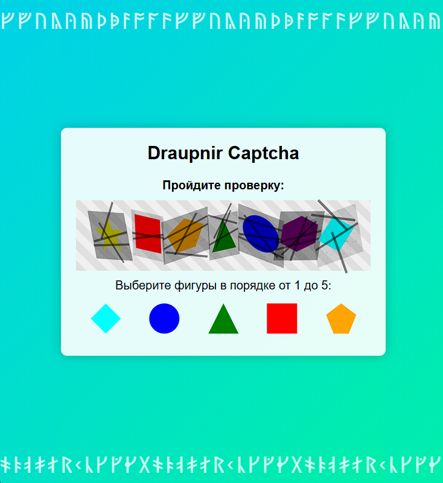

# Draupnir Captcha

## 🔐 Описание проекта

Draupnir Captcha - это современная система проверки подлинности пользователя с использованием визуальной капчи. Проект реализует уникальный подход к защите веб-ресурсов от автоматизированных ботов и неавторизованного доступа.

### Особенности
- Интуитивный интерфейс выбора фигур
- Многоуровневая система верификации
- Поддержка русского языка
- Минималистичный дизайн с элементами рунической стилистики

## Скриншот интерфейса

## 🛠 Технологии

- HTML5
- CSS
- JavaScript

## 📦 Установка

1. Клонируйте репозиторий
2. Откройте `index.html` в современном веб-браузере
3. Следуйте инструкциям на странице капчи

## 🚀 Использование

- Выберите фигуры в правильном порядке (от 1 до 5)
- После корректного выбора появится сообщение "Проверка пройдена!"

## 🤝 Вклад в проект

Мы открыты для pull requests и issues. Пожалуйста, следуйте стандартным GitHub workflow.

## 🔗 Контакты

- email: 8draupnir.holder8@gmail.com
- TG: @Draupnirholder

  # Draupnir Captcha

## 🔐 Project Description

Draupnir Captcha is a modern user authentication system using visual captcha. The project implements a unique approach to protecting web resources from automated bots and unauthorized access.

### Features
- Intuitive figure selection interface
- Multi-level verification system
- Russian language support
- Minimalist design with runic stylistic elements

## 🛠 Technologies

- HTML5
- CSS
- JavaScript

## 📦 Installation

1. Clone the repository
2. Open `index.html` in a modern web browser
3. Follow the instructions on the captcha page

## 🚀 Usage

- Select figures in the correct order (from 1 to 5)
- After correct selection, a message "Verification passed!" will appear

## 🤝 Contributing

We are open to pull requests and issues. Please follow standard GitHub workflow.

## 🔗 Contacts

- email: 8draupnir.holder8@gmail.com
- TG: @Draupnirholder
